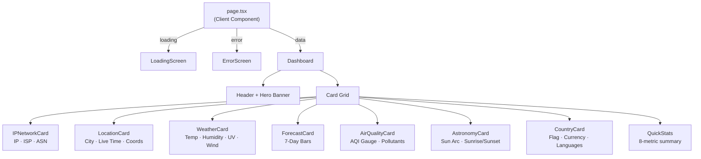
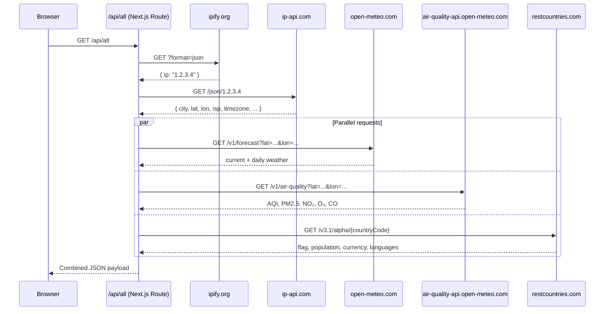

# IP2Data

A real-time dashboard that takes your public IP address and chains it through a series of free APIs to surface geolocation, live weather, air quality, astronomy, and country data — all in one clean, dark-themed UI.

> **Live demo:** Deploy to Vercel in one click — no API keys required.

---

## Data Pipeline

```mermaid
flowchart LR
    A([Browser]) -->|Request| B[/api/all]

    B -->|1 Detect IP| C[(ipify.org)]
    C -->|public IP| B

    B -->|2 Geolocate IP| D[(ip-api.com)]
    D -->|city · lat · lon · ISP · timezone| B

    B -->|3 Parallel fetch| E & F & G

    E[(open-meteo.com\nWeather)] -->|temp · wind · UV · 7-day forecast| B
    F[(open-meteo.com\nAir Quality)] -->|AQI · PM2.5 · NO₂ · O₃| B
    G[(restcountries.com)] -->|flag · currency · population| B

    B -->|Combined JSON| A
```

---

## Component Architecture



---

## API Route Flow



---

## Project Structure

```
ip2data/
├── app/
│   ├── layout.tsx              # Root layout + SEO metadata
│   ├── page.tsx                # Entry point — loading / error / dashboard states
│   ├── globals.css             # Dark theme, glass cards, animations
│   └── api/
│       └── all/
│           └── route.ts        # Single server route — chains all APIs
├── components/
│   ├── Dashboard.tsx           # Layout: header, hero, card grid, footer
│   ├── LoadingScreen.tsx       # Animated stage-by-stage loading UI
│   ├── ErrorScreen.tsx         # Error state with retry
│   └── cards/
│       ├── IPNetworkCard.tsx   # IP address, ISP, org, ASN
│       ├── LocationCard.tsx    # City, live local clock, timezone, coords
│       ├── WeatherCard.tsx     # Current weather, UV index, visibility
│       ├── ForecastCard.tsx    # 7-day forecast with animated temp bars
│       ├── AirQualityCard.tsx  # SVG AQI gauge + pollutant grid
│       ├── AstronomyCard.tsx   # SVG sun arc, sunrise/sunset/daylight
│       └── CountryCard.tsx     # Flag image, population, currency, languages
├── lib/
│   ├── types.ts                # TypeScript interfaces for all API responses
│   └── utils.ts                # Weather codes, AQI levels, formatters
├── next.config.ts
├── tailwind.config.ts
├── vercel.json
└── package.json
```

---

## Tech Stack

| Layer | Choice |
|---|---|
| Framework | Next.js 16 (App Router) |
| Language | TypeScript |
| Styling | Tailwind CSS + custom glassmorphism |
| Icons | Lucide React |
| Deployment | Vercel (zero config) |
| APIs | All free, no API keys needed |

---

## Free APIs Used

| API | Data | Rate Limit |
|---|---|---|
| [ipify.org](https://www.ipify.org) | Public IP detection | Unlimited |
| [ip-api.com](https://ip-api.com) | IP geolocation, ISP, timezone | 45 req/min (free) |
| [open-meteo.com](https://open-meteo.com) | Weather + 7-day forecast + UV | 10,000 req/day |
| [air-quality-api.open-meteo.com](https://open-meteo.com/en/docs/air-quality-api) | AQI, PM2.5, NO₂, O₃, CO | 10,000 req/day |
| [restcountries.com](https://restcountries.com) | Flag, population, currency, languages | Unlimited |

---

## Getting Started

```bash
# Install dependencies
npm install

# Run dev server
npm run dev
# → http://localhost:3000

# Production build
npm run build
npm start
```

---

## Deploy to Vercel

```bash
# Install Vercel CLI
npm i -g vercel

# Deploy (first time)
vercel

# Promote to production
vercel --prod
```

Or connect the GitHub repo at [vercel.com/new](https://vercel.com/new) — Vercel auto-detects Next.js and deploys with zero configuration.

> No environment variables are required. All APIs are public and free.

---

## Dashboard Cards

| Card | Description |
|---|---|
| **IP & Network** | Your public IP, ISP name, organization, ASN |
| **Location** | City, region, country, live local clock, timezone, ZIP, coordinates |
| **Current Weather** | Temperature, feels-like, description, humidity, wind, pressure, UV, visibility |
| **7-Day Forecast** | Daily high/low with proportional temperature range bars |
| **Air Quality** | Circular AQI gauge with US AQI rating, PM2.5, PM10, NO₂, O₃, CO |
| **Sun & Astronomy** | Animated SVG sun arc, sunrise, sunset, total daylight duration |
| **Country Info** | National flag, official name, population, area, currency, languages |
| **Quick Stats** | 8-metric at-a-glance summary panel |
